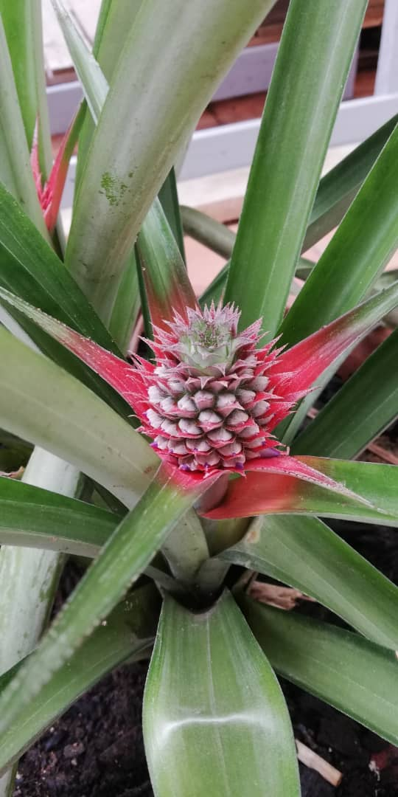

# LA PIÑA
## Plantar una piña en maceta
¿Te imaginas poder tener plantada una piña en casa?. Puedes sorprender a familiares o amigos plantando esta fruta tropical en casa y sin  mucho trabajo. Aqui te vamos a explicar como hacerlo con pasos muy sencillos.
## Pasos para cultivar la piña en maceta
1. La corona de la piña se debe quitar ya sea cortándola o girando. Toda la carne también deben ser recortadas de su base de manera que no se pudra después de la siembra. Esta es la parte que solemos tirar a la hora de consumirla.
2. Una vez tenemos la corona, sumergimos la parte del tronco en agua hasta que veamos que comienza a echar raices, cambiar el agua cada día, una vez que tenemos las raices, la pasamos a una maceta.
3. La maceta se prepara con una mezcla, dos partes de tierra fértil con una parte de arena blanca. Añade algunas piedras pequeñas a la mezcla con el fin de fomentar un buen drenaje ya que esta planta no le va bien el exceso de agua.
4. Después, hay que **regarla una vez** y colocarla **junto a una ventana** para que le de la luz exterior. Además, hay que tener en cuenta que no soporta bien las bajas temperaturas.
Un pequeño truco para solucionar el frio en invierno ***Se le puede hacer un pequeño invernadero para mantener una temperatura cálida de una manera sencilla, colocando un pequeño plástico alrededor.***



5. Una vez pasadas dos o tres semanas, las hojas del centro comenzarán a crecer; señal de que la planta a comenzado a tener raices.
***La temperatura nunca debe bajar de 15º***
6. La mata de la piña ira creciendo poco a poco llegando a lograr una mata muy grande, y después saliendo un **tallo del centro.**
De este tallo, aparecerá la nueva piña.
7. **De 15 o 24 meses**podremos cosechar ya sus deliciosos frutos, mientras es una planta decorativa muy bonita y buena para purificar el aire de la casa.
8. La planta también tendrá hijuelos, que brotan en los laterales y se pueden trasplantar.
9. La piña ha de cosecharse cuando esté en su punto, cuando el color de la base de la piña cambie de verde a amarillo. La planta muere después de dar el fruto, quedando los hijos que van saliendo sucesivamente.

``` bash
#!/bin/bash
echo "¿Que os parece?, sencillo ¿verdad?"
```
